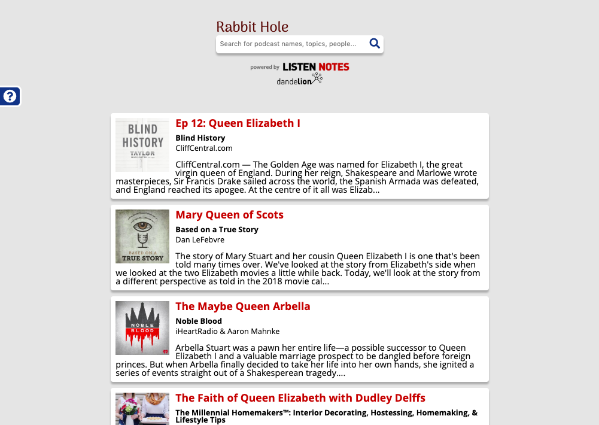

# Rabbit Hole - Listen. Read. Learn More.
[Rabbit Hole](https://rise-erpelding.github.io/rabbit-hole/) is a search engine that allows users to find educational podcasts. Users can listen to podcasts in the app, and also see links to Wikipedia articles that may be related to the podcast episode they are listening to. Users also have the option to search Wikipedia or click on links to other wikipedia articles inside the app, allowing for a user experience akin to "falling down a rabbit hole."

## Features
- Search for educational podcasts
- Listen to podcasts
- See links to Wikipedia articles that may be related to the podcast episode
- Read wikipedia articles in the app or search Wikipedia

## Built With
- HTML
- CSS
- JavaScript
- jQuery

## APIs Used
- [Listen Notes API](https://www.listennotes.com/)
- [Dandelion API](https://dandelion.eu/)

## Screenshots
Landing page:

Search results:

Podcast player and details for podcast episode, with Wikipedia links:

Wikipedia within the app:

[See Rabbit Hole in action](https://rise-erpelding.github.io/rabbit-hole/)

